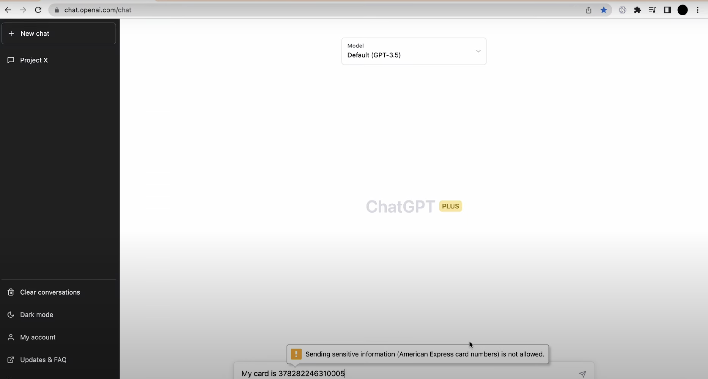

# ChatGPT Secure Chrome Extension 

[Chrome web store](https://chrome.google.com/webstore/detail/chatgpt-secure/hodneljnifpbcnhmlommhmmpoknlioil)

Prevents sensitive information disclosure and protects from content hijacking attack on https://chat.openai.com/

Prevents sensitive information disclosure and protects from content hijacking attack on https://chat.openai.com/
ChatGPT Secure is designed to protect users from the potential copy-pasting of sensitive information to ChatGPT. Also, it prevents potential content hijacking attacks via prompt injection.

If you have any feedback or suggestions feel free to contact me via yevhsec1@gmail.com
